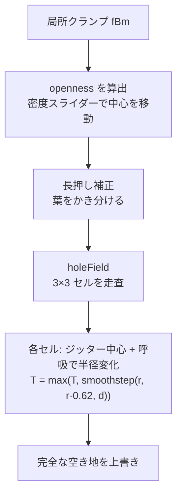
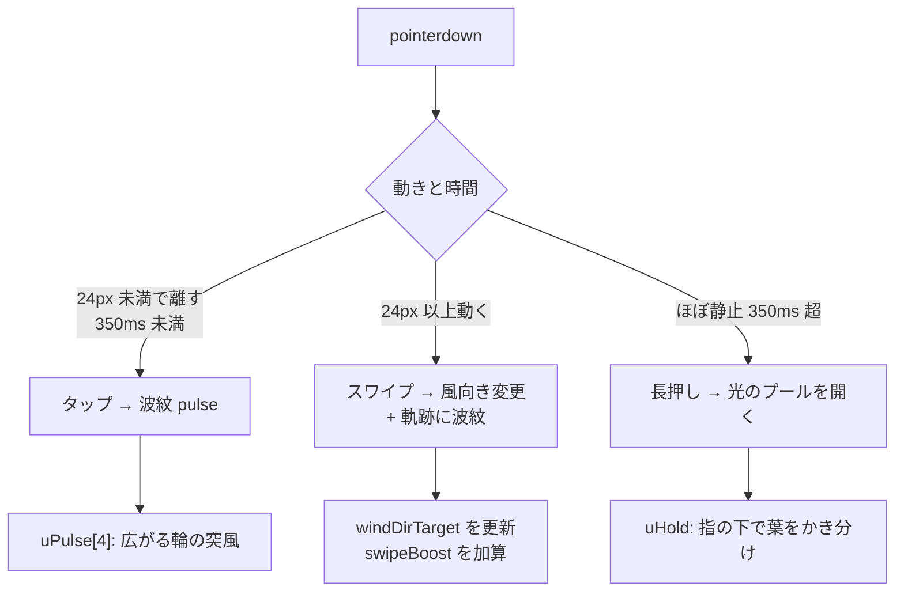
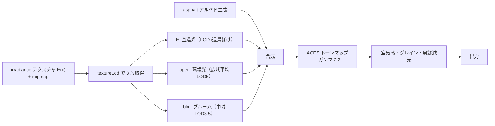
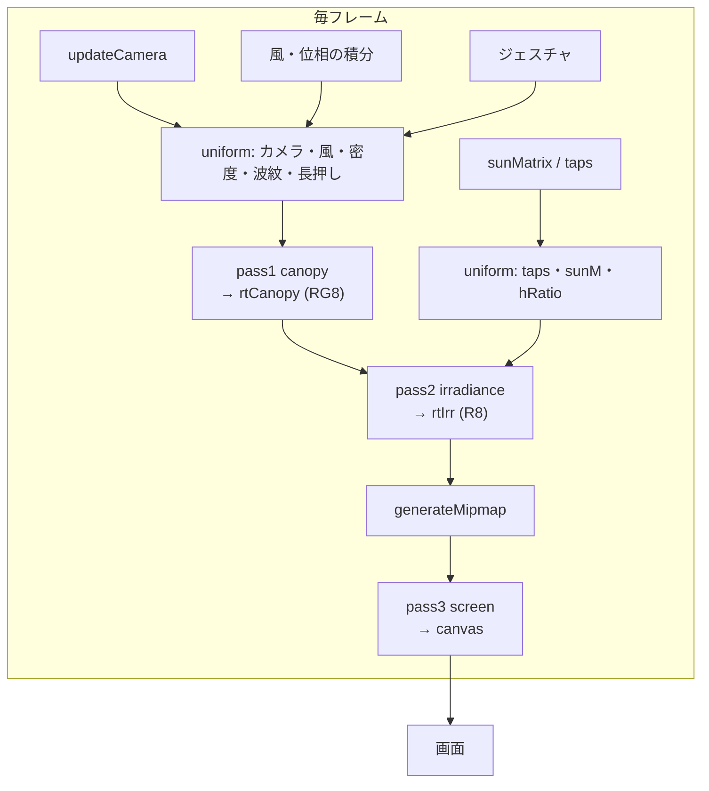

# アルゴリズム詳細

`script.js` の各アルゴリズムを図入りで解説する。物理の前提は [komorebi-research.md](komorebi-research.md)、パイプライン全体は [ARCHITECTURE.md](ARCHITECTURE.md) を参照。

---

## 1. 太陽円盤の畳み込み（pass2 irradiance）

### 1.1 アイデア

地面の照度は「開口透過率 ⊛ 太陽円盤」の畳み込み（ケプラーの光図形理論）。これを各画素で**角度空間の積分**として直接評価する。

ある地面の点 `p` に届く直達光の照度 `E(p)` は、太陽円盤上のすべての方向 `ω` について、その光線が樹冠を透過できたかを平均したもの。

```
        太陽円盤（視直径 0.53°）
         ___
        /   \      ω：円盤内の方向
       | ·48 |     48 点を Vogel 螺旋でサンプル
        \___/
          \
           \  各 ω に対し、地面オフセット δ = (ω_xz / ω_y)·h
            \
   ━━━━━━━━━━━ 上層樹冠（高さ h）━━━━━━━━━━━━
            \         δ_upper = sunMatrix · ω
   ━━━━━━━━━ 下層樹冠（高さ h·0.32）━━━━━━━━━
            \         δ_lower = δ_upper · 0.32
             ●  地面の点 p
```

各タップで「上層の透過率 × 下層の透過率」を取り、周辺減光ウェイトで重み付き平均する。

### 1.2 シェーダの核心

```glsl
for (int i = 0; i < N_TAPS; i++) {        // N_TAPS = 48
  vec3 tp = uTaps[i];                      // xy=単位円盤上の位置, z=減光ウェイト
  vec2 d  = rotate(tp.xy, rot);            // 画素ごとに回転（バンディング除去）
  vec2 oA = uSunM * d;                     // 単位円盤 → 上層の地面オフセット [m]
  float T = texture(uCanopy, projGround(p + oA)).r          // 上層
          * texture(uCanopy, projGround(p + oA * uHRatio)).g; // 下層
  E += tp.z * T;
  W += tp.z;
}
oE = vec4(E / W, 0., 0., 1.);
```

### 1.3 Vogel 円盤と周辺減光

48 個のサンプルを Vogel 螺旋（黄金角 137.5°）で配置し、円盤を均一に覆う。各点には太陽の周辺減光（リム・ダークニング）を表すウェイトを持たせる。

```javascript
for (let i = 0; i < N_TAPS; i++) {
  const r = Math.sqrt((i + 0.5) / N_TAPS);   // 等面積になる半径
  const a = i * 2.399963229728653;           // 黄金角 [rad]
  taps[i*3]   = r * Math.cos(a);
  taps[i*3+1] = r * Math.sin(a);
  taps[i*3+2] = 1 - 0.56 * (1 - Math.sqrt(Math.max(0, 1 - r*r)));  // 周辺減光
}
```

```
   Vogel 円盤（48 点）          周辺減光ウェイト（断面）
      · · ·  ·                  w │ ▔▔▔▔●▔▔▔▔   中心は明るい
    ·  · ·· · ·                   │▕         ▏
   · ·· ●·· · ·                   │▏  1-0.56  ▕  縁は暗い
    · · ·· ·  ·                   │●         ●
      ·  · ·                      └────────────── r
   等面積・均一被覆               r=0      r=1
```

**画素ごとの回転**: 各画素で円盤を `hash12(gl_FragCoord.xy)` のランダム角だけ回す。48 タップの離散化が生む渦巻き状のバンディングをノイズに変えて目立たなくする。

### 1.4 楕円が自動で出る理由 — sunMatrix

太陽は円盤だが、斜め投影で地面では楕円になる。これを近似式で描かず、**単位円盤 → 地面オフセットのヤコビアン（2×2 行列）を数値微分で厳密に求める**。

```javascript
function sunMatrix(elevDeg, hA) {
  const e = elevDeg * RAD, a = SUN_AZIM;
  const S  = [cos(e)*sin(a), sin(e), cos(e)*cos(a)];  // 太陽中心方向
  const B1 = norm(cross(S, [0,1,0]));                 // 円盤の基底1
  const B2 = cross(B1, S);                            // 円盤の基底2
  // 円盤内オフセット (tx,ty) → 地面オフセット (x/y, z/y)
  const f = (tx, ty) => {
    const w = norm([S + tx*B1 + ty*B2]);   // 模式
    return [w[0]/w[1], w[2]/w[1]];          // 地面 y=0 への射影
  };
  // 中心差分でヤコビアンの 4 成分を得る
  const eps = 1e-4, k = SUN_HALF_ANGLE * hA / (2*eps);
  ...
  return [列優先 mat2];
}
```

この行列に円盤内方向を掛けるだけで、

- **楕円の伸長** `1/sin(θ)`（仰角が低いほど長く伸びる）、
- **長軸の向き**（太陽方位の地面投影方向）、
- **樹冠の高さ `h` に比例したスポット径**

がすべて自動的に正しく出る。早見表は [komorebi-research.md §2](komorebi-research.md) を参照。

```
  仰角 90°(真上)     仰角 60°        仰角 35°
      ●              ◗              ▬◗▬
   正円            やや楕円        強く伸長
   ELONG=1.0       ELONG=1.15      ELONG≈1.74
```

---

## 2. 樹冠の透過率場（pass1 canopy）

樹冠を 2 層で表す。出力は `RG8` テクスチャ（R=上層, G=下層）。

```
  R チャネル ── 上層: 高い樹冠・大きな葉群・ゆったり揺れる
                → ジッター格子の「丸い穴」モデル
  G チャネル ── 下層: 低い枝葉・細かい・速い揺れ + 枝
                → fBm 閾値モデル
```

### 2.1 上層 — ジッター格子の穴フィールド

葉群の間の隙間は「孤立した小さな穴の集まり」。セルごとに 1 個の穴を置き、**局所開度 `openness`** が穴の半径を決める。



```
  密 (openness 小)      中 (openness 中)        疎 (openness 大)
  ┌───────────┐        ┌───────────┐          ┌───────────┐
  │ ·       · │        │  ◦ ◦  ◦   │          │ ███  ████ │
  │     ·     │        │ ◦ ◦◦ ◦ ◦  │          │ ████████  │
  │ ·     ·   │        │  ◦  ◦◦  ◦  │          │  ███████  │
  └───────────┘        └───────────┘          └───────────┘
  まれに小穴=暗部に     房状の密集            穴が融合して
  ぽつぽつ光る点        (ぶどうの房状)        光のプールへ
```

各セルの穴は 2 つの動きを持つ。

- **小さな周回**: 中心が `sin/cos` でゆっくり回り、葉の揺れを表す。
- **呼吸**: 半径が `0.76 + 0.40·sin(...)` で開閉する。位相と速さはセルごとの乱数。この**呼吸が「風で光が明滅する」核心**。

```glsl
float breathe = .76 + .40 * sin(tph * (.9 + 1.3*h2) + h.x * 6.28);
float r = max(openness * (.26 + 1.25*h2*h2) * breathe - .05, 0.);
float d = length(fc - c) * distort;        // distort = 輪郭の有機的歪み
T = max(T, smoothstep(r, r*.62, d));        // セル内の穴を合成
```

> **設計上の転機**: 当初は上層も fBm 閾値方式だったが、隙間率を上げると穴が「数」でなく「サイズ」で育ち、迷路状に連結（パーコレーション）して孤立した丸いスポットにならなかった。これが穴ベース生成に切り替えた根本理由。

### 2.2 下層 — fBm 閾値方式

プール内を横切る葉影（pinspeck）・小さく鋭いスポット・枝を担う。

```glsl
float clump = fbm2(w * clumpF, ...);                 // 葉群のかたまり
float leaf  = fbmLeaf(w * leafF, tz, ...);           // 細かい葉のテクスチャ
float tau   = mix(taub + .09, taub - .13, openness); // 閾値（密度で可変）
float T = smoothstep(tau, tau + edge, leaf);
T = max(T, 1. - smoothstep(.13, .26, clump));        // 大きな空き＝白いプール
// 枝: ノイズ等高線で細い線を彫る（遠景ではフェード）
T *= 1. - .88 * branch * bmask * bfade;
```

閾値 `tau` は fBm の標準偏差（≈0.10）に合わせて調整し、隙間率をパーコレーション閾値以下に保つ。これで隙間が孤立した丸い穴になる（密: 〜3% / 中: 〜15% / 疎: 〜50%）。

### 2.3 遠景の扱い（footprint フェード）

`fp`（1 テクセルの地面サイズ）が大きい遠景では、高周波のノイズオクターブを平均値 0.5 へフェードさせ、ちらつきを防ぐ。

```glsl
float fade = 1. - smoothstep(.2, .5, fpc * fr);  // 高周波ほど早くフェード
s += amp * mix(.5, vn2(q), fade);
```

オクターブ間で座標を回転（`ROT`）させ、value noise の正方格子による角張りも消している。

---

## 3. 風のモデル

光が「漂いながら明滅して形が変わる」動きを、複数の独立した時間スケールの重ね合わせで作る。

```mermaid
flowchart LR
    subgraph CPU["CPU で積分する状態"]
        G1["突風エンベロープ<br/>nGust1·0.6 + nGust2·0.4"]
        SW[スワイプブースト]
        WP["windPhase<br/>(呼吸・隙間位相)"]
        WT["windTravel<br/>(突風前線の移動)"]
    end
    G1 --> GUST[gust = wind·(0.25+1.1·env)+boost]
    SW --> GUST
    GUST --> WP
    GUST --> SH["GPU: windField()"]
    WT --> SH
    WP --> SH
```

### 3.1 成分一覧

| 成分 | 時間スケール | 実装 |
|---|---|---|
| 突風エンベロープ | 10〜30 s | CPU の 1D ノイズ 2 オクターブ × 風スライダー |
| 突風前線 | 〜数秒 | 風向きに ~6m/s で流れる 3D ノイズ（`windField` 内） |
| 枝の揺れ | 0.3〜0.6 Hz | 低周波ノイズ + 進行波。風向きにコヒーレント |
| 葉のはためき | 1.5〜2.5 Hz | 高周波・小振幅ノイズ |
| 隙間の開閉 | セルごと | 穴半径を `sin` で呼吸（位相・速さはセル乱数） |

### 3.2 GPU 側の変位場 `windField`

```glsl
vec2 windField(vec2 p, float t, float swayA, float flutA, float ph) {
  float front = .55 + .9 * vn3(vec3(p*.12 - uWindTravel, ph*3.1));  // 突風前線
  float g = uGust * front;
  // タップ波紋・長押しの寄与を加算（後述）...
  vec2 sway = uWindDir * (...) ;     // 枝の揺れ（低周波・進行波）
  vec2 fl   = ...;                    // 葉のはためき（高周波）
  return swayA * g * sway + flutA * pow(g, 1.4) * fl * 2.;
}
```

### 3.3 なぜ位相を積分するか

`windPhase` と `windTravel` は毎フレーム `dt × 係数` を加算して**積分**する。

```javascript
windPhase    += dtr * (0.05 + 2.0 * gust);
windTravel[0] += dtr * 0.7 * windDir[0];
windTravel[1] += dtr * 0.7 * windDir[2];
```

`t × gust` のように毎回掛け直すと、風の強さや向きを変えた瞬間に位相が不連続にジャンプし、スポットが一瞬で別の形になる。積分すれば、風を変えても光のパターンが連続的に変化する。

---

## 4. ジェスチャ → 風への写像



- **タップ波紋** `uPulse[i]`（最大 4 個）: 地面位置・経過秒・強さを持ち、`windField` 内で `exp(-rr²)` の広がる輪として葉をざわめかせる。3 秒で減衰消滅。
- **スワイプ**: なでた方向（地面座標）に `windDirTarget` を向け、`swipeBoost` を突風として加算。風向きは `windDir` を指数移動平均でなめらかに追従させる。前線移動（`windTravel`）も積分なので連続。
- **長押し** `uHold`: 350ms 以上ほぼ静止で成立。`hold.k` を 0.7s かけて立ち上げ、指の下の `openness` を上げて（葉をかき分けて）光のプールを開く。ドラッグで追従、離すと減衰して閉じる。

画面座標から地面座標への変換は `screenToGround`（CPU）と `groundAt`（GPU）で対応する。

---

## 5. 地面の合成（pass3 screen）

照度テクスチャ `E(x)` を地面のアスファルトに重ね、写真的に仕上げる。



要点：

- **mipmap の再利用**: 環境光（`open`）・ブルーム（`blm`）を pass2 の mipmap から `textureLod` で取得。専用のぼかしパスを持たない。
- **遠景の光学ぼけ**: `flod = 2.0 · smoothstep(4,12,dist)` で距離に応じて LOD を上げ、ぼけと圧縮感を出す。
- **アスファルト アルベド**: 広域のむら・2〜6cm の濃淡・約 1.4mm の骨材粒・明るい砕石チップを多重ノイズで合成。`fp` でグレインを距離フェード。
- **写真的フリンジ**: ペナンブラ（半影）をわずかに暖色へ寄せ、太陽縁の減光と大気散乱を模す。砕石のきらめきは日なたのみ。
- **後処理**: ACES トーンマップ → ガンマ補正 → 遠景の空気感（霞）→ フィルムグレイン → 周縁減光（ビネット）。

---

## 6. データフロー全体図



各記号の意味・定数の値は `script.js` 冒頭の定数定義と各パスのコメントに対応する。
</content>
