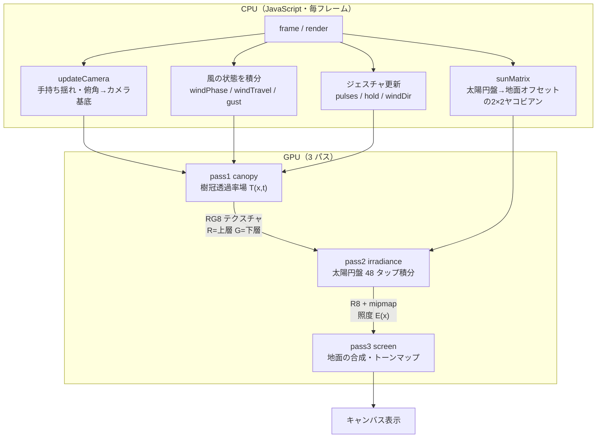
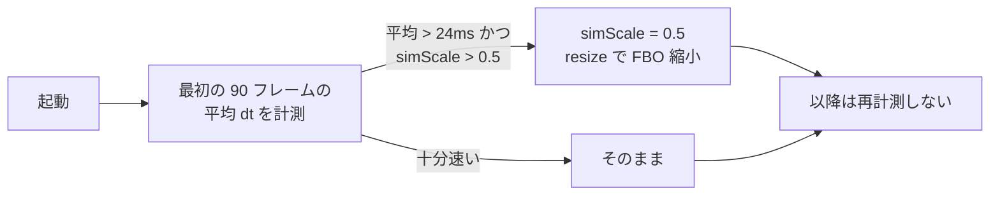

# アーキテクチャ

木漏れ日（`script.js`）の全体構成を解説する。物理の背景は [komorebi-research.md](komorebi-research.md)、各アルゴリズムの詳細は [ALGORITHM.md](ALGORITHM.md) を参照。

## 1. 設計の核心

地面の照度を、次の畳み込みとして**そのまま GPU で計算する**ことが設計の出発点。

```
E(x) = ( 樹冠の開口透過率 T )  ⊛  ( 太陽円盤 )
```

- スプライト（光の点をテクスチャで貼る）方式は、スポットの「重なりによる融合」と隙間の「開閉による明滅」を原理的に表現できない。
- そこで、各画素ごとに太陽円盤（視直径 0.53°）の上の 48 方向を実際にサンプリングし、その方向の光線が樹冠を透過したかを積分する。
- この畳み込みから、次の三態がパラメータ調整なしに自動的に現れる。

```
 小さな隙間 (a ≪ s)        中間 (a ≈ s)            大きな開口 (a ≫ s)
 ┌───────────┐            ┌───────────┐          ┌───────────┐
 │     ·   · │            │   ◍  ◍    │          │  ███████  │
 │   ·  ●  · │   →        │  ◍ ███ ◍  │   →      │ █████████ │
 │     ·   · │            │   ◍  ◍    │          │  ███████  │
 └───────────┘            └───────────┘          └───────────┘
 楕円の太陽像              スポットが融合           開口形状そのまま
 (Sonnentaler)            し始める                (光のプール)
```

`a` = 開口サイズ、`s` = 地面上の太陽像サイズ。

## 2. レンダリングパイプライン（毎フレーム・全パス画面空間）

3 つのフラグメントシェーダパスを順に実行する。すべてフルスクリーン三角形（頂点 3 つ）で描き、計算は各画素で行う。



### パスの責務

| パス | 入力 | 出力 | 役割 |
|---|---|---|---|
| **pass1 canopy** | カメラ・風・ジェスチャの uniform | `RG8`（R=上層透過率, G=下層透過率） | 風で変形する樹冠の透過率場 `T(x,t)` を生成 |
| **pass2 irradiance** | canopy テクスチャ・太陽タップ・`sunMatrix` | `R8` + mipmap（照度 `E(x)`） | 太陽円盤上 48 方向を積分（= 畳み込み）。周辺減光つき |
| **pass3 screen** | irradiance テクスチャ | キャンバス | 透視投影した地面にアスファルト質感を合成し、ACES トーンマップ |

mipmap は pass2 の出力に対して生成し、pass3 で環境光（広域平均）とブルーム（中域ぼかし）として安価に再利用する（追加パス不要）。

### なぜ画面空間か

樹冠も照度も**カメラから見た地面**の上で計算する。3D ジオメトリやシャドウマップを持たず、各画素で「この画素が映す地面の点」を逆投影（`groundAt`）して扱う。これにより：

- 描画コストが画面解像度（実際にはその 0.66 倍のシミュレーション FBO）にのみ比例する。
- 太陽内方向のサンプリングは、地面オフセットへの線形写像（`sunMatrix`）一発で済む。

オフスクリーンの 2 パス（canopy / irradiance）は、畳み込みの縁余白を確保するため表示視野より `EXPAND = 1.09` 倍広い視野で描く。

## 3. 座標系と投影

```
        カメラ (CAM_H ≈ 1.5–3.0m)
          \
           \  視線方向 uCamF（俯角 pitch）
            \
   ──────────●────────────────  地面 y = 0（xz 平面・単位 m）
            groundAt(uv)
```

- **カメラ基底** `uCamR, uCamU, uCamF`（右・上・前）を CPU で構成。yaw→pitch の順に作るので真上 90° でも縮退しない。俯角が深いほどカメラ高を 1.5→3.0 m に上げ、視野の地面スパンを保つ。
- **`groundAt(uv)`**（GLSL）: 画面 UV → 視線レイ → 地面 `y=0` との交点 `[m]`。
- **`projGround(g)`**（GLSL）: 地面の点 → 画面 UV。pass2 でタップをリプロジェクションするのに使う。
- **footprint** `fp = max(|dFdx(p)|, |dFdy(p)|)`: 1 テクセルが覆う地面の大きさ `[m]`。遠景ほど大きく、これをアンチエイリアスと LOD のフェード基準に使う（遠景のちらつき防止）。

## 4. CPU と GPU の責務分担

| 担当 | 内容 |
|---|---|
| **CPU（JS）** | カメラ基底の構成・手持ち揺れ、風の状態（突風エンベロープ・前線移動・呼吸位相）の**積分**、ジェスチャ解釈（タップ波紋・スワイプ風向き・長押し）、太陽円盤→地面オフセットの 2×2 ヤコビアン（`sunMatrix`）の数値計算、Vogel 円盤タップと周辺減光ウェイトの事前計算、uniform 転送、自動負荷調整 |
| **GPU（GLSL）** | 樹冠透過率場の生成（ノイズ・穴フィールド・枝）、太陽円盤 48 タップの積分、アスファルト アルベド生成、トーンマップ・グレイン・周縁減光 |

風の位相（`windPhase`）や前線移動（`windTravel`）を **CPU で積分する**のが要点。`t × 風係数` のように毎フレーム掛け直すと、風の強さや向きを変えた瞬間に位相が飛び、スポットが瞬時に別の形になってしまう。積分しておけば連続性が保たれる。

## 5. リソースとライフサイクル

```
resize()  ── DPR を最大 2 にクランプ → キャンバス実解像度を決定
          ── simScale (0.66 / 低速端末は 0.5) と MAX_SIM_W=1600 で
             シミュレーション FBO サイズを決定
          ── rtCanopy (RG8, mipmap なし) と rtIrr (R8, mipmap あり) を再生成
```

- **`rtCanopy`** = pass1 の出力先（線形補間・mipmap なし）。
- **`rtIrr`** = pass2 の出力先（mipmap あり）。pass3 で `textureLod` を使い、遠景のぼけ・環境光・ブルームを LOD で取り出す。
- ウィンドウリサイズ時に両 FBO を作り直す（`window.resize` イベント）。

## 6. 自動負荷調整



シミュレーション解像度のみを下げ、表示解像度（pass3）は維持するため、UI の鮮明さを保ったまま負荷を軽くできる。

## 7. デバッグ・検証フック

`window.__komorebi` に検証用 API を公開している。

| API | 用途 |
|---|---|
| `state()` | 風向き・スワイプブースト・位相・波紋数などの現在状態 |
| `advance(s)` | 時間を `s` 秒進める（動きの確認用） |
| `set(k, v)` | パラメータ `P[k]` を直接設定 |
| `time()` | 現在の累積時間 |
| `bench(n)` | `n` フレームを連続描画して 1 フレームあたりの平均ミリ秒を返す |

## 8. 旧実装との関係

`opus/` には Canvas 2D のスプライト方式（Opus 4.7 作）を**無編集**で保存している。リアルな Sonnentaler は小さく地味なため、あちらは物理を骨格にしつつ「光のプール／楕円太陽像／キャノピー影／葉シルエット／ブルーム／大気の緑被り」を階層的に重ねて視覚を増幅する設計だった。スポットの融合と隙間の明滅を原理的に出せない限界から、現行の畳み込み方式（`script.js`）へ置き換えた。両者を見比べられるよう公開ページに残してある。
</content>
